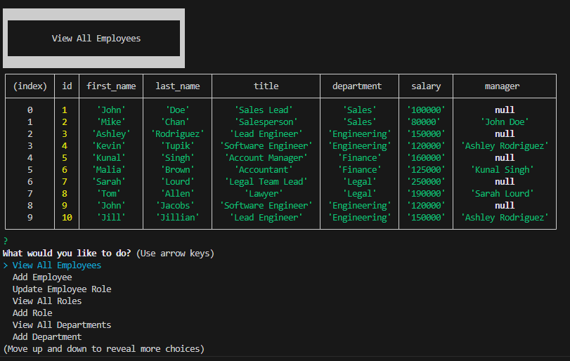

# Employee Database
  ## Description
  A MYSQL Database that manages employee's by job title, department, and managers.
  
  ## Table of Contents

  [Installation](#installation)
  
  [Usage](#usage)
  
  [License](#license)
  
  [Contributing](#contributing)
  
  [Questions](#questions)

  ## Installation
  Simply open the folder up with VS Code. Do a npm install to install all the addons. Update the db.js EXAMPLE to reflect your mysql login information. Create the database employee_db and load schema/seeds files into your SQL. Launch in terminal by typing node index.js. From there navigate prompts as needed and select quit to exit.

  ## License
  

  https://opensource.org/licenses/MIT

  Copyright 2023 kylatae

     
        Permission is hereby granted, free of charge, to any person obtaining a copy of this software and associated documentation files (the “Software”), to deal in the Software without restriction, including without limitation the rights to use, copy, modify, merge, publish, distribute, sublicense, and/or sell copies of the Software, and to permit persons to whom the Software is furnished to do so, subject to the following conditions:
        
        The above copyright notice and this permission notice shall be included in all copies or substantial portions of the Software.

        THE SOFTWARE IS PROVIDED “AS IS”, WITHOUT WARRANTY OF ANY KIND, EXPRESS OR IMPLIED, INCLUDING BUT NOT LIMITED TO THE WARRANTIES OF MERCHANTABILITY, FITNESS FOR A PARTICULAR PURPOSE AND NONINFRINGEMENT. IN NO EVENT SHALL THE AUTHORS OR COPYRIGHT HOLDERS BE LIABLE FOR ANY CLAIM, DAMAGES OR OTHER LIABILITY, WHETHER IN AN ACTION OF CONTRACT, TORT OR OTHERWISE, ARISING FROM, OUT OF OR IN CONNECTION WITH THE SOFTWARE OR THE USE OR OTHER DEALINGS IN THE SOFTWARE.

  ## Contributing
  Currently this is a solo project and has reached its conclusion for progress.

  ## Questions
  Please contact me using my github page at https://www.github.com/kylatae or email at kylatae@gmail.com

  ## Preview Page

Video Link:[https://www.github.com/kylatae/employee_tracker/lib/vid/](https://www.github.com/kylatae/employee_tracker/lib/vid/)

Repo Link:[https://www.github.com/kylatae/employee_tracker/](https://www.github.com/kylatae/employee_tracker/)
